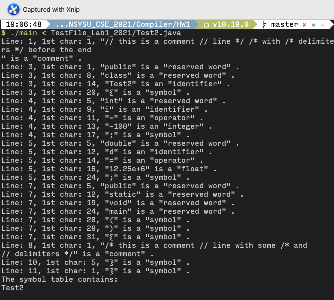

## Compiler HW1 
---
### Simple java scanner
#### Flex version :
- 2.6.4
#### Running Platform :
- Ubuntu 20.04.2 LTS
#### How to run :
    make clean all
    ./main < testfile.java
#### How the program is done :
- Lexical definitions :
    - Symbols, Reserved word, Identifiers, Integer, Float, String
    - Whitespace, Comments
        - commentnewline() will count the newline char '\n' in the comment
- Symbol table :

    A global variable table[100] is defined as symbol table, it contains 100 struct object 
    ```c
    struct sym{
        char *data;
    };
    ```
    - ***create()*** : init the table
    - ***lookup(s)*** : return the index of string s in table. If not found, return -1
    - ***insert(s,len)*** : insert string s with length len to the table, return the index
    - ***dump()*** : output value in table
#### Problems I met :
- complex c-style comments are hard to identify

    eg : 
    ```c
    /*comment */ int mycode /*more comment*/ 
    ```
#### Testfile outputs : 





